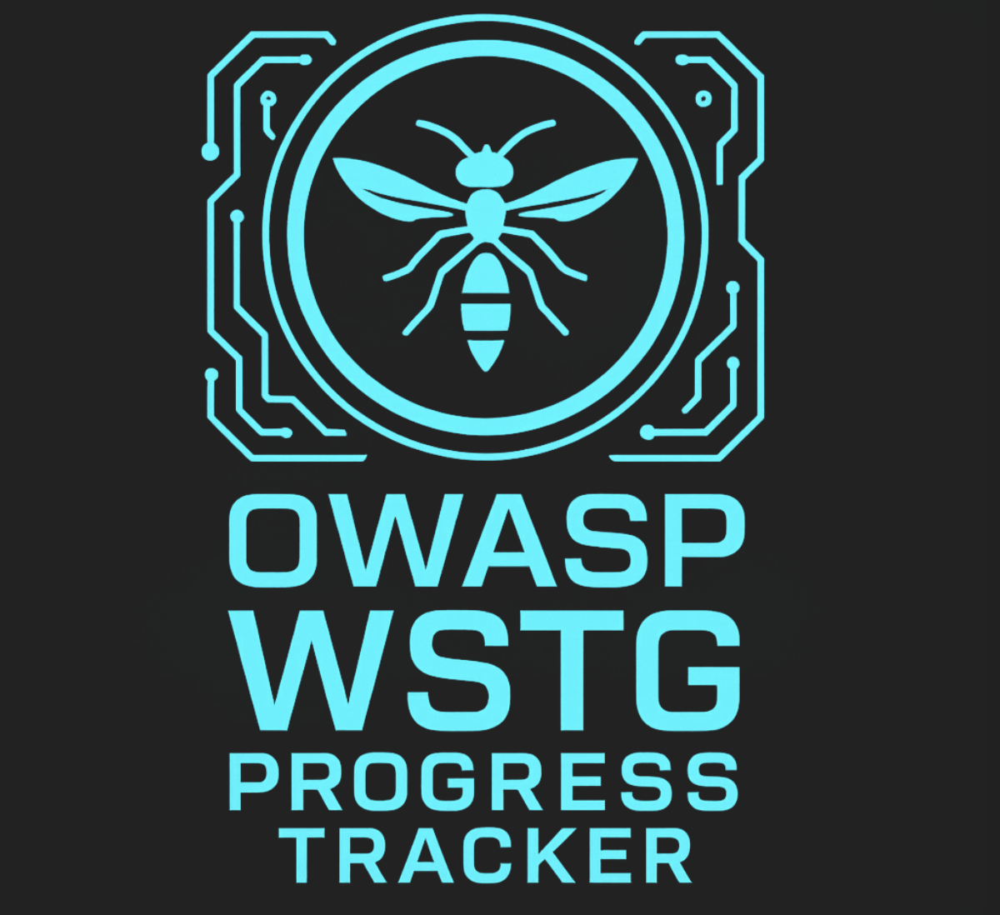

<center></center>

# OWASP WSTG Progress Tracker

This is a continuation project of `OWASP WSTG Tracker` by Adan Álvarez. I came across his post on LinkedIn and realized that this is something i personally should be using. Its always difficult to maintain `Excel Sheets`. 

While Adan has done an amazing job for releasing the initial project which can be found at below location. 

https://github.com/adanalvarez/owasp-wstg-tracker/tree/main

I have been able to make some major changes which i believed are going to change the way this tool can be utilized in day to day operations for Application Security as well as by the Developers. 

## Installation

At first, you need to download the repository and then simply run the following two commands. 

```
npm install
```
```
npm run dev
```

## Additional Functionality

This update includes the following enhancement. 

1. `Light Mode`/`Dark Mode` 
2. Addition of evidence as an attachment with notes. 
3. Saving evidence snaps as Base64 blobs when saving the results in `JSON` format. 
4. Every upload of previously saved `JSON` data having evidence will be pre-populated automatically. 
5. Generation of `PDF Reports`. The initial details of the report are configurable via `Report Generation Menu`.


## Community Call

I personally believe in this project and i believe this will add more value for everyone across the community and we don't know this might become a go to tool within the corporate entities, having a mindset to support and use `Open-Source` projects. 

## Demo 

<video width="800" height="600" controls>
  <source src="https://youtu.be/fd55mXat5NU" type="video/mp4">
</video>