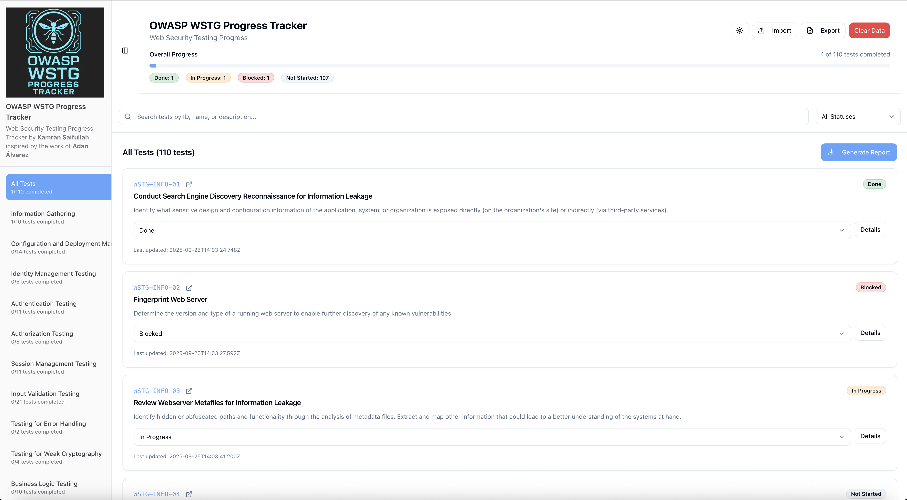
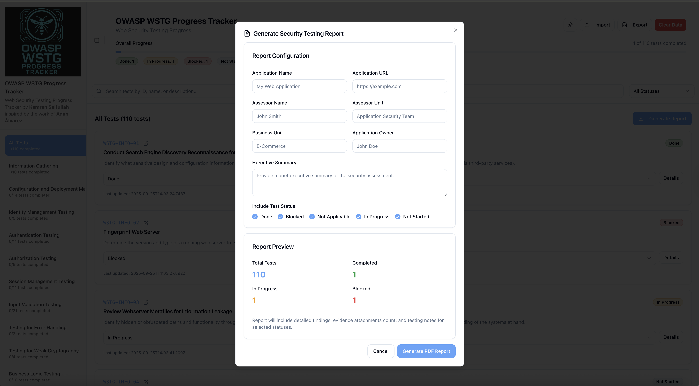
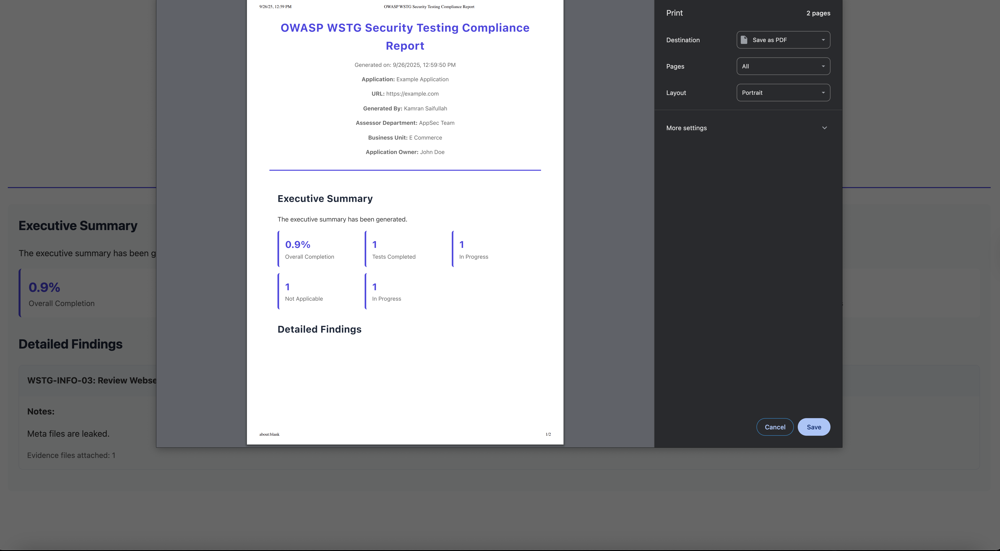

<p align="center">
</p>

# OWASP WSTG Progress Tracker

This is a continuation project of `OWASP WSTG Tracker` by Adan Álvarez. I came across his post on LinkedIn and realized that this is something i personally should be using. Its always difficult to maintain `Excel Sheets`. 

While Adan has done an amazing job for releasing the initial project which can be found at below location. 

https://github.com/adanalvarez/owasp-wstg-tracker/tree/main

I have been able to make some major changes which i believed are going to change the way this tool can be utilized in day to day operations for Application Security as well as by the Developers. 

## Installation

At first, you need to download the repository and then simply run the following two commands. 

```
npm install
```
```
npm run dev
```

## Additional Functionality

This update includes the following enhancement. 

1. `Light Mode`/`Dark Mode` 
2. Addition of evidence as an attachment with notes. 
3. Saving evidence snaps as Base64 blobs when saving the results in `JSON` format. 
4. Every upload of previously saved `JSON` data having evidence will be pre-populated automatically. 
5. Generation of `PDF Reports`. The initial details of the report are configurable via `Report Generation Menu`.

# Usage

The usage of the application is fairly simple. The first and the foremost is the WSTG checklist that goes into `src/data/external-checklist.jso`, this requies to be updated with the latest releases of `OWASP WSTG`. Then thre is a second file named `owaspTests.ts` which loads up the checklist when you start the application server. 

For the time being it only supports the `OWASP WSTG` checklist, but the work in progress is to have customer checklists as well. 

The dashboar is fairly simple, no login and nothing, just a dashboard where you can update the status of each of the item and track the progress. It does not automatically removes the progress, but the recommended way is to have the data exported as a `JSON` file. As it stores the evidences in `Base64 Blobs` so you dont have to save the evidence saparately. 

I have also added a `PDF Report` generation i.e. if you are working on a particular application for a client or just want to show how good you are with the reporting, the default template is included, you just simply have to fill in some fields and it will generate the report for you automatically. You can simply have it saved while it updates the data and its good to go. 







## Community Call

I personally believe in this project and i believe this will add more value for everyone across the community and we don't know this might become a go to tool within the corporate entities, having a mindset to support and use `Open-Source` projects. 

